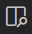

# Laboratorium 04

Od dzisiaj, do zapisywania treści poleceń/zadań laboratoryjnych będziemy używali formatu __Markdown__. Edytor __VS Code__ wspiera najważniejsze elementy tego formatu bez konieczności instalowania rozszerzeń. Przykładowo:

- szybkie przemieszczanie się po strukturze rozdziałów i podrozdziałów: `Ctrl-Shift-o`
- podgląd dokumentu (w osobnej zakładce): z wciśniętym klawiszem `Alt` klikamy w ikonkę:

    

Więcej na temat wsparcia dla formatu __Markdown__ w edytorze __VS Code__ możecie przeczytać na stronie [Markdown and Visual Studio Code](https://code.visualstudio.com/docs/languages/markdown).

## Zadanie 04.01

Zdefiniuj funkcję

```scala
def ciąg(n: Int): Int = {
    0
}
```

zwracającą dla podanej wartości argumentu _n_, _n_-ty element ciągu C, wyrażonego wzorem:

```scala
C(0) == 2
C(1) == 1
C(n) == C(n - 1) + C(n - 2) dla n > 1
```

Pierwsze 10 wyrazów ciągu to: `2`, `1`, `3`, `4`, `7`, `11`, `18`, `29`, `47`, `76`.

Rozwiąż to zadanie __bez używania zmiennych__ oraz wykorzystując __rekurencję ogonową__.

## Zadanie 04.02

Stosując rekurencję ogonową (i nie żywając zmiennych) zdefiniuj funkcję:

```scala
def tasuj(l1: List[Int], l2: List[Int]): List[Int] = {
    Nil
}
```

łączącą ze sobą listy liczb całkowitych z zachowaniem porządku rosnącego (a ściślej „niemalejącego”). W szczególności oznacza to, że jeśli `l1` i `l2` będą uporządkowane to wynik również będzie uporządkowany. W wyniku „kolejno” nie powinny pojawiać się identyczne elementy.

Przykład:

```scala
val lista1 = List(2, 4, 3, 5)
val lista2 = List(1, 2, 2, 3, 1, 5)

tasuj(lista1, lista2) == List(1, 2, 3, 1, 4, 3, 5) // true
```

W definicji wykorzystaj mechanizm __dopasowania wzorca__. Dla przypomnienia, przykład z materiałów z ostatniego wykładu, który, co prawda, dodatkowo obsługuje „dowolne listy” (czyli List[A], gdzie „A” jest parametrem):

```scala
// PRZYKŁAD: Korzystając z rekurencji ogonowej zdefiniujmy sobie
// funkcję obliczającą długość dodwolnej listy:
def długość[A](lista: List[A], dł: Int = 0): Int = lista match {
  case _ :: ogon => długość(ogon, dł + 1)
  case _ => dł
}
```

__Uwaga__: Symbol `_` we wzorcu `_ :: ogon` oznacza, że nie interesuje nas czym jest „głowa listy” (bo i tak nie zamierzamy z tego korzystać), ważne jedynie, że lista jest  niepusta (bo ma „głowę” i „ogon”). Gdybyśmy chcieli do czegoś użyć wartość „głowy” to moglibyśmy to zrobić np. tak:

```scala
def długość2[A](lista: List[A], dł: Int = 0): Int = lista match {
  case głowa :: ogon =>
    println(s"„Głową” listy $lista jest $głowa")
    długość(ogon, dł + 1)
  case _ => dł
}
```

## Zadanie 04.03

Stosując _rekurencję ogonową_ oraz mechanizm _dopasowania wzorca_ zdefiniuj funkcję:

```scala
def sumuj(l: List[Option[Double]]): Option[Double] = {
    None
}
```

zwracającą sumę wszystkich elementów listy `l` postaci `Some(d)`, gdzie `d` > 0. Jeśli takich elementów na liście `l` nie ma, to funkcja powinna zwrócić wartość `None`.

__Przykład__:

```scala
val lista = List(Some(4.0), Some(-3.0), None, Some(1.0), Some(0.0))

sumuj(lista) == Some(5.0) // true
```
